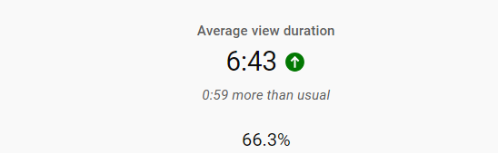

# AVD-Percentage-Viewer
Chrome Extension that allows you to view the Average View Duration (AVD) of a Youtube video in Youtube Studio.

Useful for the first two days before Youtube displays the AVD-Retention Graph

